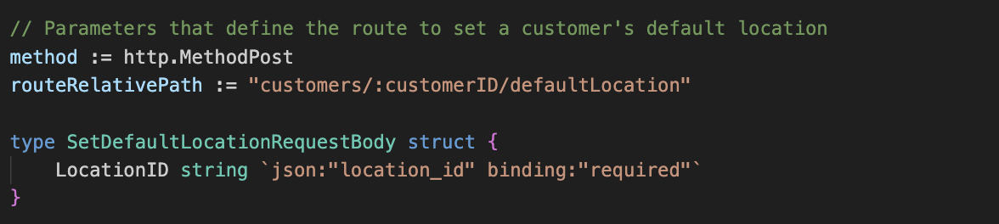
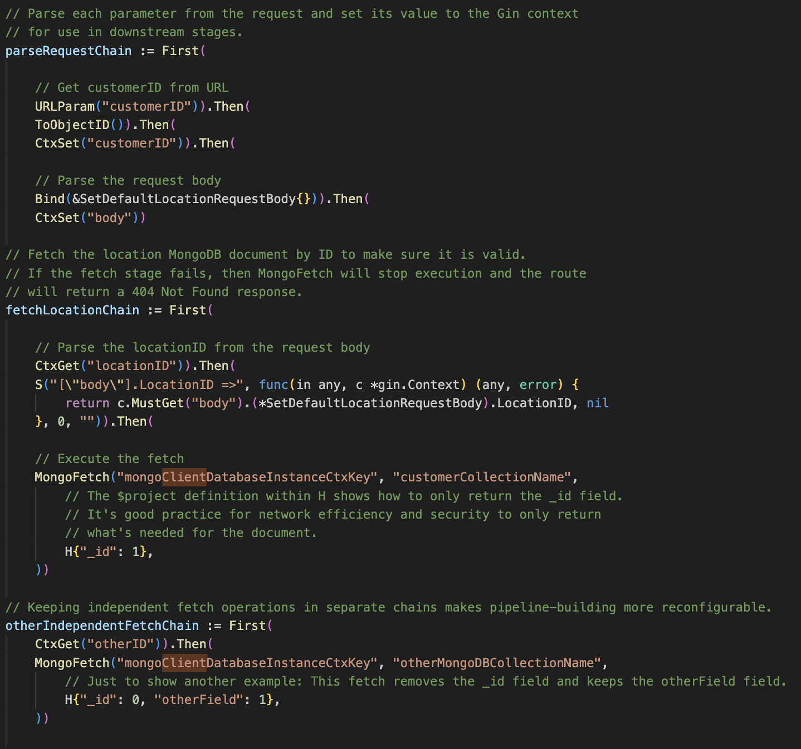
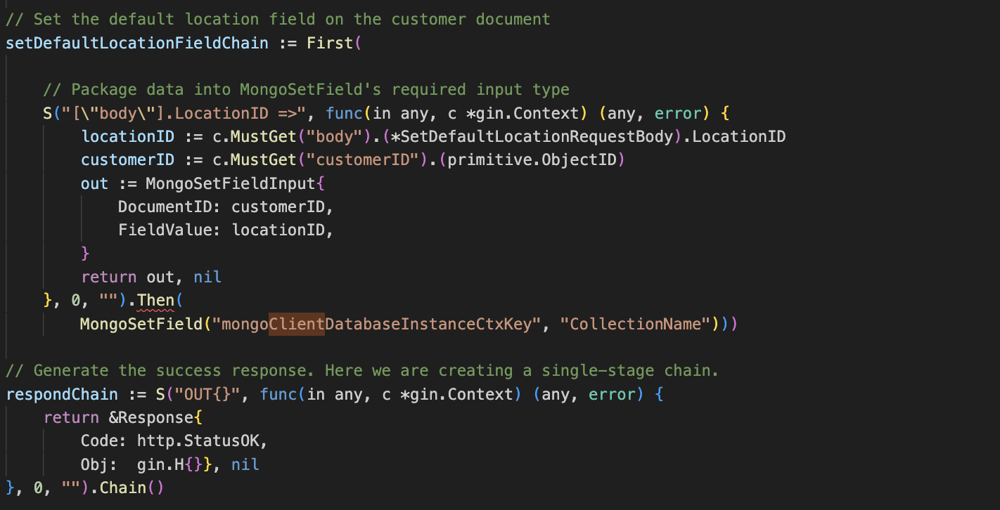
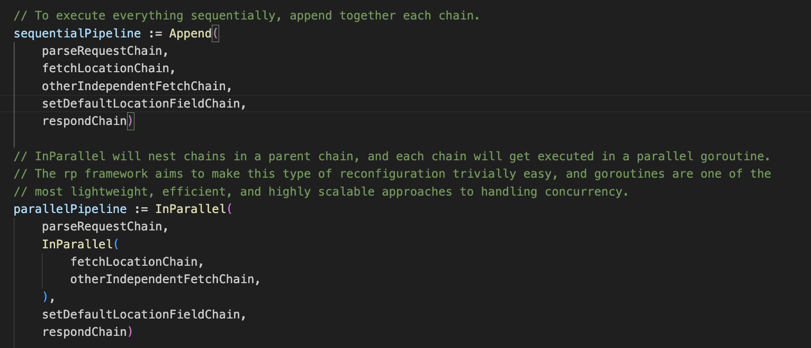
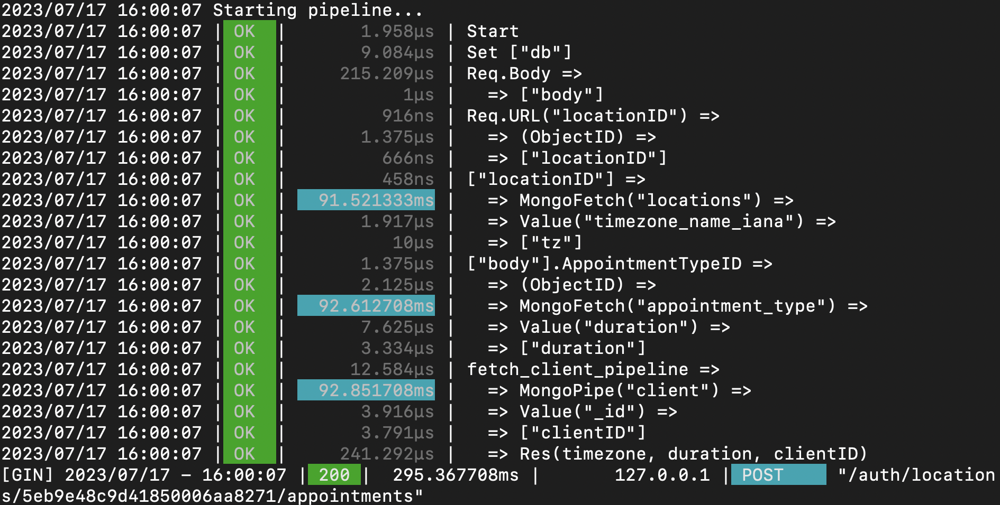
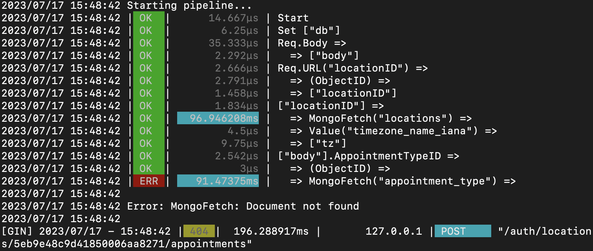

# rp
rp, or "Request Pipeline", is a lightweight, chain-based framework for building request handlers that are easier to read, debug, reconfigure, and maintain. It also makes concurrent execution of request subtasks easy since subchains can be parallelized in just a single line of code. rp is written in Go and based on [Gin](https://github.com/gin-gonic/gin), Go's [top web framework](https://github.com/EvanLi/Github-Ranking/blob/master/Top100/Go.md).

### UNDER DEVELOPMENT - I expect to have a stable version in a couple of weeks. This README will be updated as progress is made.

---

### How It Works

Define complete, error-handling request pipelines by chaining together stages of discrete tasks. Here is a four-stage pipeline chain for a REST API GET request.

```go
getCustomerName := First(
    URLParam("customerID")).Then(
    ToObjectID()).Then(
    MongoFetch(databaseKey, customersCollectionName, H{
        "firstName": 1,
        "lastName":  1})).Then(
    Out(http.StatusOK))
```

Upon execution the pipeline extracts the customerID from the URL, converts it to a valid MongoDB ObjectID type, fetches the document's name fields, and then writes them to the response. Any verbose task execution, error handling, and logging code is defined internally for each stage.

Modular, well-defined stages make analysis and debugging more immediate and straightforward. The debug logs will tabulate pipeline run metrics by stage, showing timestamp, success or failure, and latency.

```
// Successful request
2023/07/19 09:15:42 | OK  |       3.208µs | Req.URL("customerID") =>
2023/07/19 09:15:42 | OK  |         833ns |   => .(ObjectID) =>
2023/07/19 09:15:42 | OK  |  121.874958ms |   => MongoFetch("customers") =>
2023/07/19 09:15:42 | OK  |       3.625µs |   => OUT{_id, firstName, lastName}

// Request failed due to a malformed customerID in the URL
2023/07/19 09:48:32 | OK  |       2.666µs | Req.URL("customerID") =>
2023/07/19 09:48:32 | ERR |       2.791µs |   => .(ObjectID) =>
2023/07/19 09:48:32
2023/07/19 09:48:32 Error: Invalid: the provided hex string is not a valid ObjectID

// Request failed because that customerID wasn't found in the database
2023/07/19 09:50:14 | OK  |      47.792µs | Req.URL("customerID") =>
2023/07/19 09:50:14 | OK  |        1.75µs |   => .(ObjectID) =>
2023/07/19 09:50:14 | ERR |   96.946208ms |   => MongoFetch("customers") =>
2023/07/19 09:50:14
2023/07/19 09:50:14 Error: MongoFetch: Document not found
```

(TODO Add the InParallel example)

This structure and its toolset provide a variety of benefits.

| Feature | Description | Status |
| --- | --- | --- |
| Readability | Pipeline code is compact because verbose execution and error handling code is packaged within each stage. | `functional` |

## Contents

- [The Basics](#the-basics)
  - [Why does rp exist?](#why-does-rp-exist)
  - [The Problems rp Aims to Solve](#the-problems-rp-aims-to-solve)
- [Code Examples](#code-examples)

## The Basics

### Why does rp exist?

It started because I recognized a few problems had dogged me for years in our Gin-based backend, and I had an idea for a lightweight solution that could knock those all down at once. This thinking dovetailed nicely into the "chaining" architectures used in AI, even though my concept for rp doesn't work directly with AI models much at all. I believe that this similarity will actually make it very complimentary to AI chain frameworks. I have borrowed some ideas, and rp's more unique features may volunteer some ideas back towards AI.

Our startup, Purple Go, has been running continually since the end of 2016, and it's extraordinarily rare for it to go down thanks to Gin's bulletproof stability. I've also been quite happy with MongoDB as the app's database. I have directly maintained the Go codebases myself for the past ~5 years, so I have spent countless hours building out new features, fixing bugs, and thinking deep on architecture stack and code structure. I have had a number of thorough cleanup cycles where I did iterative architecture overhauls to make sure it's always getting better.

Here are the problems that I kept wrestling with.

### The Problems rp Aims to Solve

1. Lack of Readability / Transparency of High Level Server Route Code.

   I want to be able to skim the entry point of a server route's handler code and immediately know what the required request input struct is, what its response structures are, what application logic it follows during execution, and whether it takes any actions external services, e.g. sending and email or running a credit card charge. Breaking certain functionality out into internal packages seemed like a clean structure initially, but it had the byproduct of burying these code details into functions call stacks, and it was tough to handle just with documentation and smart function naming.

2. Following Go's common error checking style of "if err != nil" statements led to a lot of redundant Gin response code.

   Overall this makes it more error prone and harder to maintain code.
   I had 100's of occurences of "c.JSON(http.StatusOK" and a lot of c.JSON calls for statuses like http.StatusBadRequest. This lead me to constantly making microdecisions during development around which response code to use and error message to send. Yet the overall behavior was very similar for every server route: 1) If err != nil then send an error response and stop route execution, 2) If no function ever returns a non-nil error, then send the success response at the end.
   So I want to separate server error responses from internal Go function errors more systematically so that I don't have to pepper network code and thinking into Go application logic. I also want some strong default structures so that, in most cases, I'm happy allow defaults and not even think about what the server response is. If I do need to explicitly set it, then I only do it once and in one place.

3. Every route also includes code that is unique to itself, yet is very similar to code in a bunch of other routes.

   This made code updates on routes frustratingly slow, adding to the effect of #1. (Add more...)

4. Latency optimization was customized to each route, yet the mitigations used tricks like parallelization frequently and in the same way. (The other main way to reduce latency was to reorder and/or consolidate calls to mongodb, which is slow)

5. Developer experience building routes was often cludgy and slow. Debuggers like Delve were OK but tricky to work with. Without this print statements were the typical way, but they're annoying to write and then remove. You also had to kick of local server instances, and that added some overhead & ambiguities about host environment. Now that I've learned Next.js, I want server route building in Go to be like that: Builds happen automatically in the background as you're coding, triggered by source file saves, and the new version, with a lot of helpful debug information, is instantly visible on another window on your desktop. Having a structure that solves for 1, 2, and 3 above gives you the foundation to make it all work with just a few, probably easy-to-make framework components.

6. More fine-grained, automatic, and well-labeled version data would help with debugging a lot. (I'm planning to version every route and every stage with a hash and human-readable metadata, and that can be bundled into your server releases.)

(I'll come back and fix the rambly documentation after I have the main components in here.)

## Code Examples

The current status of the code in the repo is that it is capable of building and running route pipelines successfully in a basic way. I still have to migrate over the code for InParallel, for instance, so some of what you see below will be close to how it works once it's built.

The code in these screenshots demonstrates how to build a simple route pipeline as a Chain instance. The pipeline's Chain instance is built by creating Stage instances and linking them together into chains. The route will be defined by a single chain that fully specifies how it will execute. That's called the route's "pipeline", which is semantically a little different than the more generalized meaning of "chains".

Note that the pipeline chain will typically be built from simpler, smaller chains. That allows us to easily modify the sequential and concurrent arrangement of operations in the chain without changing much code.

Once a chain is built (whether it's the pipeline chain or something else), it can be executed by calling the Run(c *gin.Context) function on the chain instance. So one way to use rc is to wrap that Run call into a Gin route handler function. I'm working on having a formal Route object that manages this.

Suppose we have a Gin server with an endpoint defined like the screenshot:


<br clear="left"/>

The chains to parse the incoming request and make some fetches in MongoDB would look like this:


<br clear="left"/>
<br>

The first word in each line of the chain definition is the name of a function that outputs a Stage instance. The First and Then functions handle the work to link together Stages into Chains. They are named and put together this way to read more intuitively like, "My parseRequestChain first grabs the customerID URL parameter, then converts that string into a valid MongoDB ObjectID, then it sets the ObjectID to Gin's context, then..." The use of the First function is maybe the wackiest thing here, but it also makes Go auto-indent each "Stage" line by the same amount.

The parseRequestChain can handle errors and return the right error response as-is. That default handling behavior is embedded into each Stage instance as a field in the struct. I won't get into that here, but it is easily configurable to whatever you want. Any stage that fails will stop execution of any other stages, and it will generate the network error response.

In addition to working with the Gin context during execution, stages take in an untyped data object (Go's any, a.k.a. interface{}) from the upstream stage and hand off a different untyped data object to the downstream stage. This makes it so we don't have to put in a cumbersome level of Gin context reads and writes. The ToObjectID stage is specifically made for converting string type to MongoDB's primitive.ObjectID, so its required input data is a string. If it's not a string, if it's null, if it's another type, etc, then the stage fails and a network error explain what happened is sent.

One note on how the Mongo functions work: It pulls the mongo.Database instance from the Gin context, so it has to be set in middleware, before the context reaches the pipeline chain. The S stage (named "S" to denote that it is a generic wrapper of a stage where you can provide your own stage execution code) preceding the MongoFetch stage produces the _id field for the fetch operation.

To complete the pipeline, we need chains to write to the database document and then generate a response:


<br clear="left"/>

The last stage must output a data object of Response type. The respondChain is written to demonstrate the Chain() utility function for single-stage chains.

And, finally!, we generate the finalized route chain:


<br clear="left"/>

The InParallel that's demonstrated in the screenshot works like a dream, but I haven't moved it into rp as of right now. My testing involved a route that made three sequential fetches to the database. Each fetch was around ~90ms, resulting in ~270ms latency for the total route. Just wrapping the three fetches into the InParallel function dropped total latency to barely above 90ms.

Last Thing: Stages also embed a print statement template for logging, and the Run function will log it to the console when the debug var is set to true. My log of the three sequential fetches in a pipeline looked like this:


<br clear="left"/>

The third column prints each stage's latency (without any hokey log.Print's required of the developer), and the cyan coloring highlights any stage that takes longer than 1ms.

The fourth column does its best to diagram what's going on in a visually intuitive way. A CtxGet (context get) stage prints leftmost, showing that it does not directly depend on upstream stages. Stages the take an input from the immediately preceding stage are indented and start with an arrow ("=>"). Stages like ToObjectID and MongoFetch output data from their execution, so they include a second arrow, while CtxSet, which outputs nil, does not have an arrow.

The intention of logging at this level of detail as a default debug behavior is meant to show you a detailed but easy-to-read picture of each individual operation and failure point. It made my InParallel testing really quick and easy by showing all of the latencies in a table. That table also made me realize that a fresh start of the server will always have a big lag time on the first fetch to MongoDB because that connection has to re-establish itself. The detailed logging hopefully builds good knowledge and intuition too :)

Here's an example of a failure caused by sending a dummy _id value into the second fetch. The debug print makes it clear that the value sent was legitimate format for an ObjectID, but no document in the database matched it.


<br clear="left"/>
